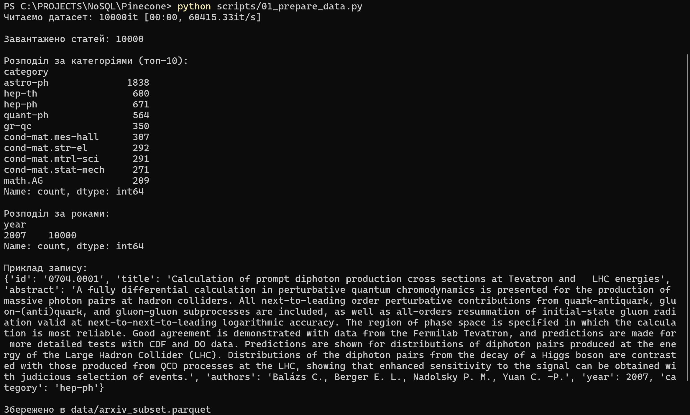
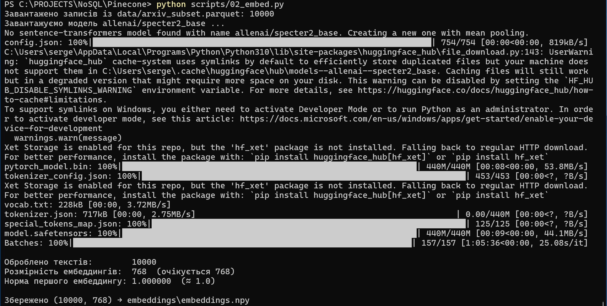
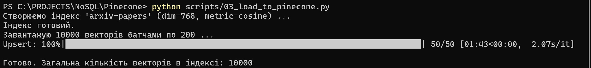
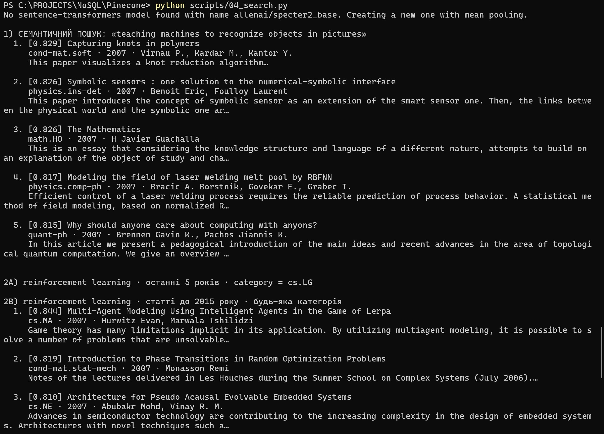
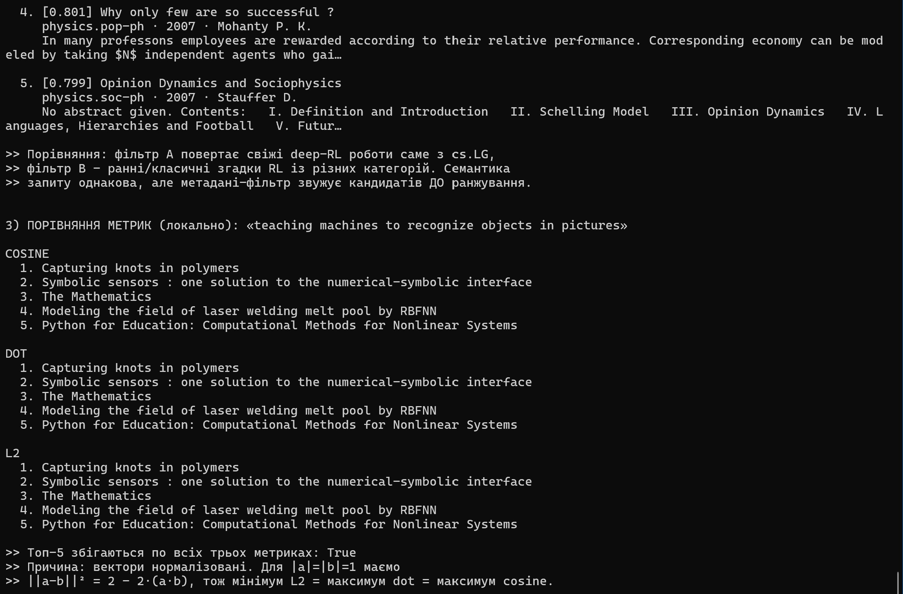
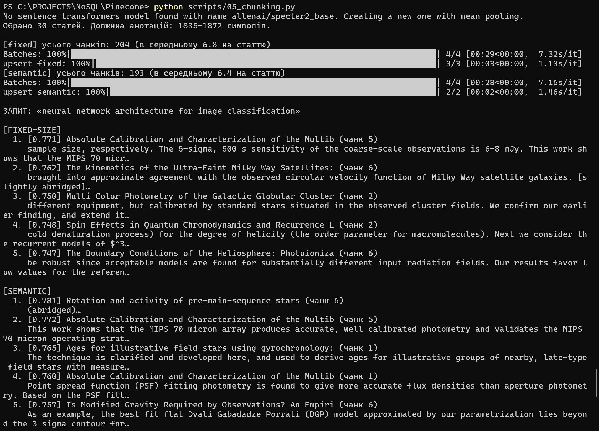
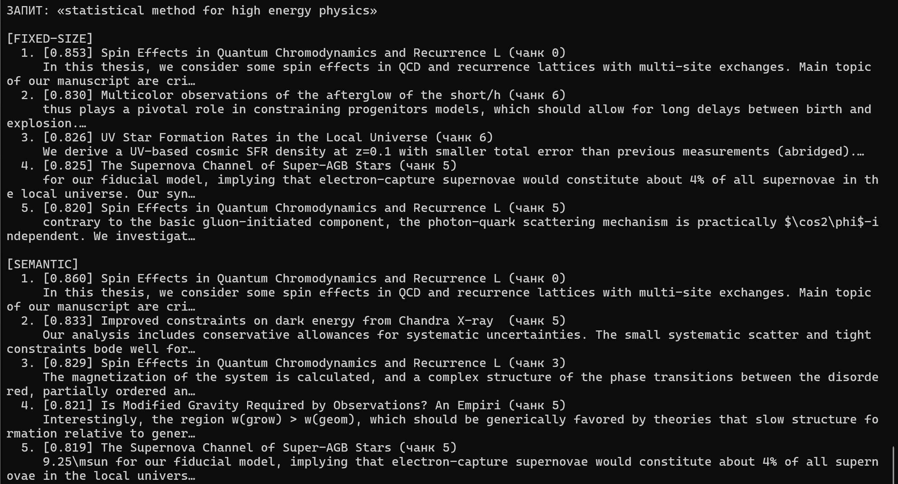
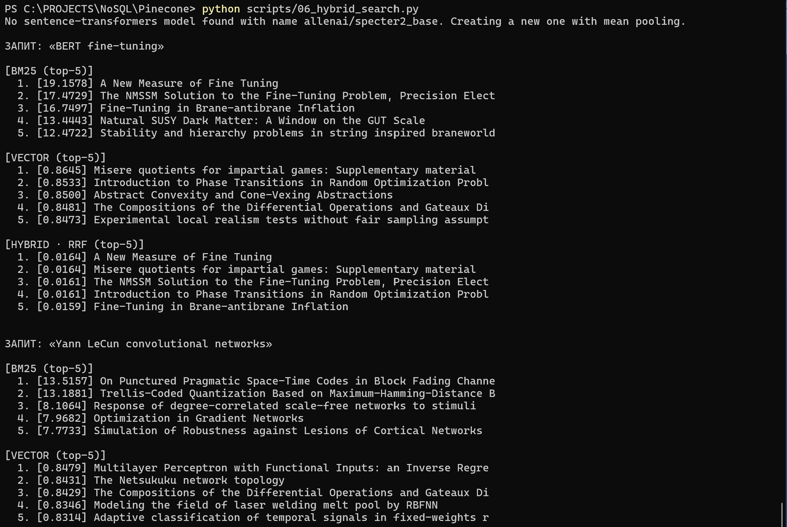
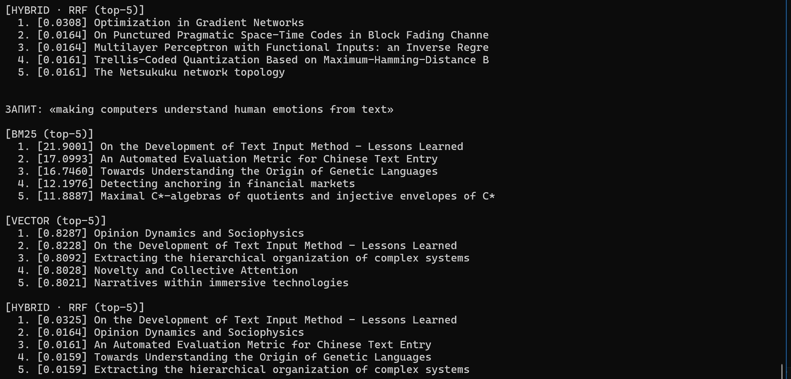

# Семантичний пошук за науковими статтями arXiv

Пайплайн повнотекстового -> семантичного -> гібридного пошуку над підмножиною
датасету **arXiv** (10 000 статей) із використанням **Pinecone** як векторної БД
і моделі ембеддингів **allenai/specter2_base**.

---

# Частина 1 Підготовка даних і вибір інструментів

## 1.2. Вибір інструментів

### 1.2.1. Відмінність Pinecone, Qdrant, Chroma

**Модель розгортання.** Pinecone - хмарний сервіс (SaaS):
власного сервера немає, працює через API, інфраструктуру (шардинг, реплікацію, 
масштабування) бере на себе провайдер. 
Qdrant - open-source движок на Rust, який можна запустити локально, у Docker, 
у Kubernetes або у власному Qdrant Cloud; тобто є і self-hosted, і managed 
варіанти. 
Chroma - легка embedded/локальна БД (фактично «SQLite для векторів»): 
запускається в тому ж процесі Python або як невеликий сервер, орієнтована на 
прототипи й локальну розробку.

**Ліцензія.** Pinecone - пропрієтарний, закритий код, оплата за використання.
Qdrant і Chroma - open-source (Apache 2.0), безкоштовні для self-host, без
ліцензійних обмежень.

**Продуктивність і масштаб.** Pinecone і Qdrant розраховані на десятки-сотні
мільйонів векторів з низькою латентністю, ANN-індексами (HNSW), фільтрацією по
метаданих і горизонтальним масштабуванням. Chroma гарно працює на декількох 
тисячах векторів у пам'яті, але не призначений для великих продакшн-навантажень.

**Коли що обирати.**
- *Pinecone* - коли потрібен продакшн без DevOps-витрат: масштабування й 
  надійність на стороні провайдера (наш сценарій).
- *Qdrant* - коли важливий контроль над інфраструктурою, дані не можна віддавати
  у чужу хмару (приватність, on-prem), потрібні розширені фільтри й при цьому
  масштаб; готові тримати DevOps.
- *Chroma* - прототип, локальний RAG, де головне - швидко почати без реєстрації.

### 1.2.2. Чому specter2_base, а не all-MiniLM-L6-v2

`all-MiniLM-L6-v2` - універсальна модель загального призначення (запитання-
відповіді, побутові речення), навчена на загальнодоменних парах. Наукові
анотації мають специфічну лексику, щільну термінологію й структуру «заголовок +
анотація», де поверхневий збіг слів часто оманливий.

`allenai/specter2_base` навчена саме на наукових документах. Згідно з карткою
моделі на HuggingFace, вона тренована на понад **6 млн триплетів цитувань
наукових статей** і призначена, щоб за комбінацією заголовка й анотації
генерувати ембеддинги «для downstream-застосувань». Картка прямо перелічує
формати задач, під які модель готувалась: **Classification, Regression,
Proximity (Retrieval), Adhoc Search** - тобто пошук/ретрив є цільовим сценарієм.
Це робить її значно сильнішою для пошуку по наукових текстах, ніж універсальний
MiniLM.

### 1.2.3. Рекомендована метрика схожості

Картка моделі не виносить окремо «використовуйте метрику X»: SPECTER/SPECTER2
навчені на **триплетах** (anchor / позитив-цитований / негатив) із triplet-loss,
де модель зближує цитовані пари й віддаляє нецитовані у векторному просторі.
На практиці для ретриву використовують **cosine similarity** на нормалізованих
ембеддингах. Це важливо на етапі створення індексу, бо метрика індексу Pinecone
має відповідати простору, у якому навчена модель: якщо вектори нормалізовані й
ми створимо індекс із `metric="cosine"` (або еквівалентно dot - див. нижче),
ранжування буде коректним. Невідповідна метрика (наприклад L2 на ненормалізованих
векторах) спотворить порядок видачі. Тому в `03_load_to_pinecone.py` індекс
створюється з `metric="cosine"`.

## 1.3 Отримання ембеддингів

### 1.3.1 Чому для нормалізованих векторів cosine == dot product

Косинусна схожість за визначенням:

```
cos(a, b) = (a · b) / (|a| · |b|)
```

Якщо ембеддинги нормалізовані до одиничної довжини, то `|a| = |b| = 1`,
і знаменник перетворюється на `1 · 1 = 1`. Отже:

```
cos(a, b) = (a · b) / 1 = a · b
```

Косинус стає тотожним скалярному добутку. Саме тому ми викликаємо
`normalize_embeddings=True`: це дозволяє індексу рахувати дешевший dot product,
отримуючи той самий результат, що й cosine.






 *Примітка.* Файл `embeddings.npy` має розмір 29.3 Mb, при оьбмеженні GitHub у 25 Mb
 доданий до архіву та поідлений на частини (embeddings.zip.001 та embeddings.zip.002).

---

# Частина 3 Пошукові запити

### 1. Чи збігаються топ-5 для cosine і dot product

**Так, повністю збігаються.** Ембеддинги нормалізовані, тож для кожного документа
`cos(q, d) = q · d` (див. вивід вище). Дві метрики рахують буквально одне й те
саме число, отже й сортування ідентичне.

### 2. Чи відрізняються результати для L2

**Ні - для нормалізованих векторів L2 дає той самий топ-5.** Розкриємо квадрат
евклідової відстані для одиничних векторів:

```
‖a − b‖² = (a − b)·(a − b) = |a|² + |b|² − 2(a·b) = 1 + 1 − 2(a·b) = 2 − 2(a·b)
```

L2-відстань - спадна функція від `a·b`. Мінімізувати L2 = максимізувати dot =
максимізувати cosine. Тому ранжування ідентичне (просто порядок «найближчий =
найменша відстань» замість «найбільша схожість»). Офлайн-перевірка підтвердила:
`max|‖a−b‖² − (2−2·dot)| ≈ 8.9e-16` (машинна точність), а топ-5 усіх трьох
метрик збіглися.

### 3. Що сталося б, якби ембеддинги НЕ були нормалізовані

Метрики розійшлися б:
- **dot product** почав би залежати від довжини векторів - довші вектори
  отримали б штучно вищі скори незалежно від реального напрямку (змісту);
- **cosine** лишився б коректним (він ділить на норми й «нечутливий» до довжини);
- **L2** змішував би різницю в напрямку з різницею в довжині, бо рівність
  `‖a−b‖² = 2 − 2·cos` уже не виконується.

Тобто без нормалізації лише cosine надійно відображає семантичну близькість.



---

# Частина 4 Chunking

### 1. Яка стратегія дає осмисленіші чанки

**Semantic chunking.** Вона нарізає текст по межах речень, тож кожен чанк - це
завершена думка. Fixed-size ріже строго по N слів і регулярно розрубує речення
посередині. Приклад із тесту (fixed, size=10): чанк закінчується на
`…It learns image features. The` - фраза обірвана на артиклі. Semantic у тому ж
тексті дав цілі речення: `The results beat the baseline by a wide margin on
three datasets.`

### 2. Чи є розрізані речення і як це впливає на ембеддинги

Так - у fixed-size розрізані речення трапляються постійно. Наслідок: модель отримує 
синтаксично й семантично неповний фрагмент, ембеддинг «розмивається» - він не 
представляє ані повну попередню думку, ані наступну. Це знижує точність: 
релевантний за змістом чанк може отримати нижчий скор лише тому, що ключова 
частина речення опинилась у сусідньому чанку. Перекриття (overlap) частково 
лікує проблему, дублюючи прикордонні слова.

### 3. Як overlap впливає на кількість чанків і покриття

Крок вікна = `size − overlap`. Чим більший overlap, тим менший крок, тим **більше
чанків** (більше векторів, більше пам'яті/запитів) і **повніше покриття меж**:
ключова фраза з більшою ймовірністю цілком потрапить хоча б в один чанк.
При `overlap = 0` чанки не перетинаються - мінімум векторів, але висока ризик
«розрізати» важливу фразу рівно по межі. Це класичний компроміс
«вартість/повнота»; на практиці беруть overlap ≈ 10–20% від розміру чанка.




---

# Частина 5 Гібридний пошук

### 1. Який метод дав кращий результат і чому

Залежить від типу запиту:
- **Точний термін** (`BERT fine-tuning`) - виграє **BM25**: точний лексичний збіг
  рідкісного токена, який вектор може «розмити».
- **Ім'я автора** (`Yann LeCun convolutional networks`) - теж сильніший **BM25**:
  прізвища це токени, а не семантика; вектор не «знає» авторів.
- **Перефразування** (`making computers understand human emotions from text`) -
  виграє **векторний пошук**: жодного спільного токена з очікуваним «sentiment
  analysis», але збіг за змістом.
- **Гібрид (RRF)** стабільно тримається у топі по всіх трьох типах - він не
  «програє» жодному окремому методу й згладжує їхні слабкі місця.

### 2. Чи є в гібридному топ-5 документи, яких немає в окремих топ-5

Так, і це очікувано. RRF підсумовує внески за рангом: документ, який у BM25 на
6–7 місці, а у векторному на 6–7 місці, в жодному окремому топ-5 не з'являється,
але сумарний RRF-скор виштовхує його у спільний топ-5. Тобто гібрид нагороджує
документи, релевантні **за обома сигналами одночасно**, навіть якщо за кожним
окремо вони «другого ешелону». Скрипт явно друкує такі знахідки (рядок
`↳ У гібридному топ-5 з'явились документи поза топ-5…`).

### 3. Як k у RRF впливає на видачу (k=60 vs k=1)

`score = Sum (1/(k + rank))`. Константа `k` керує тим, наскільки різко падає вага з
рангом:
- **Малий k (k=1)** - різниця між рангом 1 і рангом 2 величезна (1/2 проти 1/3),
  тож фактично домінує найвищий ранг кожного методу; видача «жорстка», майже
  переможець-забирає-все.
- **Великий k (k=60)** - знаменник великий, ваги сусідніх рангів майже однакові
  (1/61 vs 1/62), тож враховується ширший «хвіст» обох списків, а документи, що
  стабільно присутні в обох ранжуваннях, отримують перевагу. Видача
  згладженіша й робастніша - тому 60 і є усталеним дефолтом.

Офлайн-перевірка це підтвердила: при `k=1` верхні ранги дали скори 0.75, при
`k=60` - близькі 0.032, з пропорційно меншим розривом між сусідніми позиціями.

## Порівняльна таблиця методів (Частина 5)

| Запит | BM25 (топ-1) | Vector (топ-1) | Hybrid/RRF (топ-1) | Хто виграв |
|-------|--------------|----------------|--------------------|------------|
| `BERT fine-tuning` | A New Measure of Fine Tuning - `19.16` | Misere quotients for impartial games - `0.865` | A New Measure of Fine Tuning - `0.0164` | BM25 (≈ гібрид) |
| `Yann LeCun convolutional networks` | On Punctured Pragmatic Space-Time Codes… - `13.52` | Multilayer Perceptron with Functional Inputs… - `0.848` | Optimization in Gradient Networks - `0.0308` | Vector (гібрид згладив) |
| `making computers understand human emotions from text` | On the Development of Text Input Method… - `21.90` | Opinion Dynamics and Sociophysics - `0.829` | On the Development of Text Input Method… - `0.0325` | Vector / гібрид |




---

# Частина 6 Аналіз і висновки

### 1. Семантичний пошук vs BM25

BM25 - лексичний: рахує збіг токенів із поправкою на частоту й довжину
документа. Він виграє там, де запит = точний рідкісний токен: абревіатури
(`BERT`), назви методів (`fine-tuning`), прізвища авторів (`Yann LeCun`) - у наших
прогонах саме ці запити BM25 ранжував найточніше. Семантичний (векторний) пошук
оперує змістом: запит `making computers understand human emotions from text` не
має спільних слів зі статтями про *sentiment analysis*, але вектор їх знаходить -
BM25 тут безпорадний. **Загальне правило:** точні терміни, коди, ID, імена,
рідкісні абревіатури -> BM25; перефразування, синоніми, запити «своїми словами»,
крос-доменні формулювання -> векторний. Гібрид через RRF - коли заздалегідь не
знаєш, який тип запиту прийде.

### 2. Вплив розміру чанка

**Занадто малий (10–15 слів):** чанк втрачає контекст - окремий фрагмент речення
не містить достатньо змісту, ембеддинг «загальний» і нерозрізнюваний; зростає
кількість векторів (дорожче), а точність падає через брак контексту й розрізані
речення. **Занадто великий (500+ слів):** у чанк потрапляє кілька різних тем,
ембеддинг усереднюється до «розмитого центроїда» - релевантний шматочок
«тоне» серед нерелевантного, і специфічні запити недобирають скору; плюс ризик
впертися в ліміт 512 токенів моделі. **Оптимум залежить від задачі**, але
практичний орієнтир - приблизно довжина 1–3 зв'язних речень / ~50–150 слів із
невеликим overlap; для щільних технічних текстів - менше, для оповідних - більше.

### 3. Невідповідна метрика (L2-індекс + нормалізована модель)

Цікавий випадок: **нічого страшного не сталося б - ранжування лишилось би
коректним.** Для одиничних векторів:

```
‖a − b‖² = 2 − 2·(a·b) = 2 − 2·cos(a, b)
```

L2 - строго спадна функція від cosine. Отже, «найближчий за L2» = «найбільш
схожий за cosine»: топ-K не зміниться, зміняться лише числові значення скорів
(відстань замість схожості). Тобто **для нормалізованих векторів L2 і cosine
дають однаковий порядок** - це і є наш empirically-перевірений результат із
Частини 3. Проблема виникла б у зворотному випадку: метрика cosine/dot на
**ненормалізованих** векторах - там довжина векторів спотворила б видачу.

### 4. Обмеження Pinecone Starter і масштабування до 10 млн

**Обмеження безкоштовного тіру:** один індекс, ліміт на кількість векторів і
namespace'ів, обмеження по сховищу й RPS, відсутність pod-based конфігурацій і
реплік. Для 10 000 статей цього вистачає, але створення кількох індексів для
chunking (`arxiv-chunks-fixed`, `arxiv-chunks-semantic`) уже впирається в ліміт
«один індекс» - на Starter їх доводиться створювати/видаляти по черзі або
рознести по namespace'ах.

**Якби датасет був 10 млн статей:**
- перейти на платний serverless-тір Pinecone (або self-host Qdrant) із шардингом;
- завантажувати не циклом, а паралельними асинхронними upsert'ами великими
  батчами; розглянути квантизацію векторів (int8/PQ) для зменшення сховища;
- винести повні тексти й метадані в окреме сховище (parquet/Postgres/S3), а в
  векторну БД класти лише вектор + мінімальні поля для фільтрів, підтягуючи решту
  за ID після пошуку;
- використовувати namespace'и для логічного розділення (за роками/категоріями),
  щоб звужувати простір пошуку;
- генерацію ембеддингів масштабувати на GPU/батч-інференс або керований
  embedding-сервіс, бо 10 млн × specter2 на одній GTX 1650 рахувалися б надто
  довго.




---
